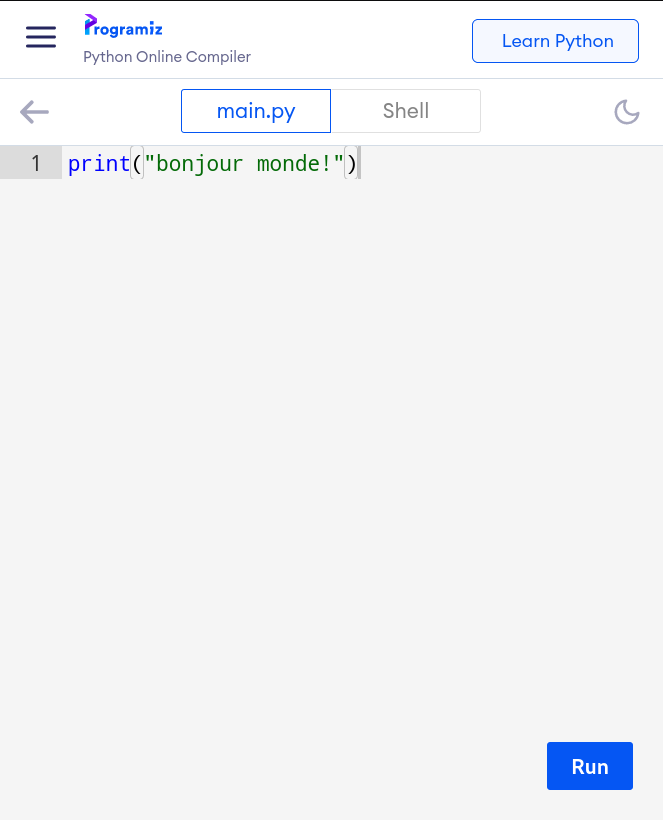

## premier exemple

[https://bit.ly/2QJIGTO](https://bit.ly/2QJIGTO)


Note:
bonjour, juste avant, si vous le voulez je vais vous demander d'aller sur ce lien là https://bit.ly/2QJIGTO ou de scanner le qr code ce qui vous permettra si vous le souhaiter de coder en python sur votre téléphone. 


## explication rapide



Note: (essayer de montrer si possible à partir de l'ordinateur)
ici c'est le site web programiz, sur téléphone, *pose la question si quelqu'un est sur ordinateur*: alors si vous êtes sur ordinateur c'est la même chose sauf que l'onglet main.py et shell sont l'un à coté de l'autre. 
Donc l'onglet main.py est l'onglet de code, vous pouvez faire ce que vous voulez dedans, et l'onglet shell est l'onglet résultat, si vous voulez faire tourner votre programme vous pouvez 
cliquer sur "run" en bas. Puis le programme serra lancé et le resultat s'affichera dans "Shell"


```python
print("bonjour")
```
<!-- .element: class="fragment" data-fragment-index="1" -->

Note:
Du coup vous essayez de tout supprimer le code dans main.py puis vous écrivez le code: `print("bonjour")` avec bonjour bien sur entre des guillemets, 
Je vais essayer de vous expliquer ce code, alors ici, nous faisons appel à la fonction print, oui comme en mathématique nous avons des fonctions, et cette fonction écrit ce qu'on lui donne. Ici nous avons écrit "bonjour" ce qui écrit alors bonjour dans la console