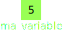

## les variables

<div class="r-hstack justify-center">
<div style="width: 40%;">

</div>
<!-- .element: class="fragment" data-fragment-index="1" -->

<div  style="width: 22%;">

```python
ma_variable = 5
```

</div>
<!-- .element: class="fragment" data-fragment-index="1" -->
</div>

Note:
comme en mathématique le python a des variables, c'est comme des boites qui peuvent stocker une valeur et qui a un nom, ici la boite est appelé ma_variable et stocke un 5


## mettre des valeurs aux variables

```python [1|2|0]
v = 5
a = v + 1
```
<!-- .element: class="fragment" data-fragment-index="1" -->

Note: 
Ici nous avons v qui stocke un 5 puis nous créons la variable a qui est égal à v + 1, ici vue que v contient 5 alors nous obtenons 5 + 1 soit 6, a est donc égal à 6 

## afficher une valeurs d'une variable

```python [1|2|0]
v = 5
print(v)
```
<!-- .element: class="fragment" data-fragment-index="1" -->

Note: 
si vous voulez afficher la valeur d'une variable, vous pouvez utiliser print, comme au début, nous avions fait print("bonjour") sauf qu'ici nous écrivons le contenu de la variable v
